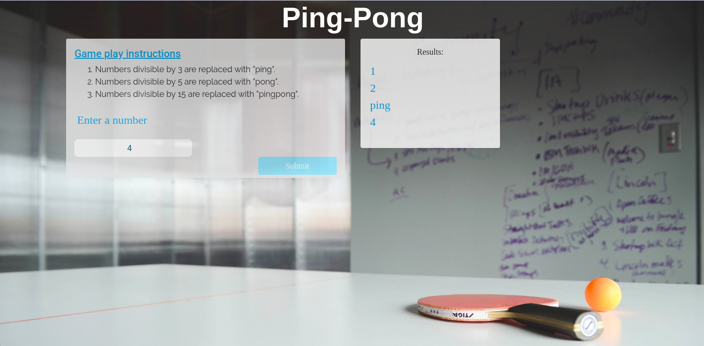

# Ping-Pong Web Application
Ping-Pong, 06/5/2018
#### By **Arnold Henry**
## Description
This is a ping-pong web application that takes a number from a user and returns a range of numbers from 1 to the chosen number with the following exceptions:
* Numbers divisible by 3 are replaced with "ping"
* Numbers divisible by 5 are replaced with "pong"
* Numbers divisible by 15 are replaced with "pingpong"

## Setup/Installation Requirements
No installation needed just click the link below to view my website online
[Ping-Pong](https://arnoldhenry.github.io/pingpong/)
## Known Bugs
No bugs
## Technologies Used
**Language used;**
* html
* CSS
* bootstrap
* jquery
## Support and contact details
Comment if any issues arise
Copyright (c) {2018} **Arnold Henry**
